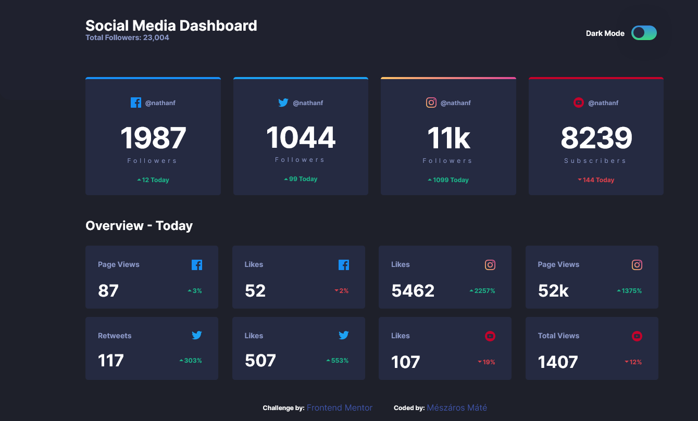
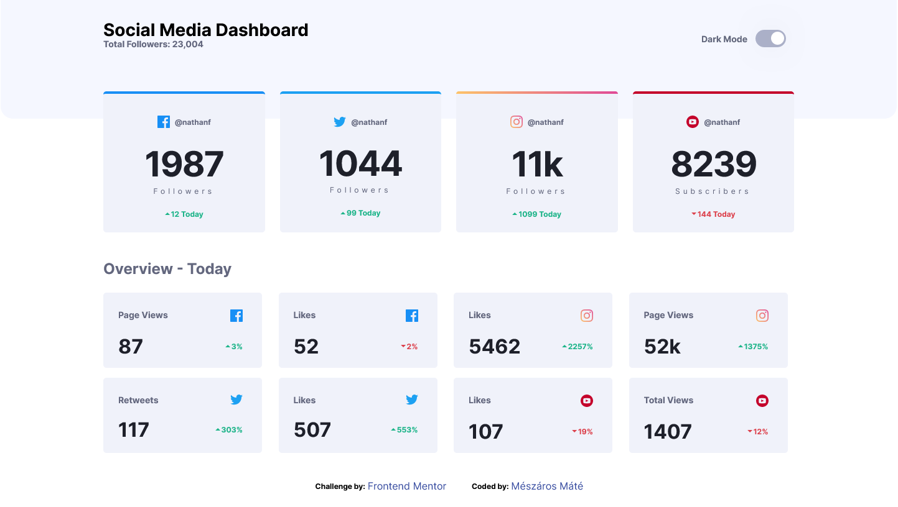

# Frontend Mentor - Social media dashboard with theme switcher solution

This is a solution to the [Social media dashboard with theme switcher challenge on Frontend Mentor](https://www.frontendmentor.io/challenges/social-media-dashboard-with-theme-switcher-6oY8ozp_H). Frontend Mentor challenges help you improve your coding skills by building realistic projects.

## Table of contents

- [Overview](#overview)
  - [The challenge](#the-challenge)
  - [Screenshot](#screenshot)
  - [Links](#links)
- [My process](#my-process)
  - [Built with](#built-with)
  - [What I learned](#what-i-learned)
  - [Continued development](#continued-development)
  - [Useful resources](#useful-resources)
- [Author](#author)

## Overview

### The challenge

Users should be able to:

- View the optimal layout for the site depending on their device's screen size
- See hover states for all interactive elements on the page
- Toggle color theme to their preference

### Screenshot

Dark Mode

Light Mode

### Links

- Solution URL: [Fronted Mentor](https://your-solution-url.com)
- Live Site URL: [github](https://mate1225.github.io/social-media-dashboard/index.html)

## My process

### Built with

- Semantic HTML5 markup
- css
- scss
- Flexbox
- CSS Grid
- Mobile-first workflow
- javascript
- node.js
- gulp

### What I learned

I leard a lot in this challeng. THe major ones are:

- the bascick of scss
- how to use css flexbox and grid together
- what is node.js and how to use it
- how to use local store for darkMode

### Continued development

css toggel button styling.

### Useful resources

-[youtube](https://www.youtube.com/playlist?list=PLUWqFDiirlsu5az5EIyxe8ZddyNO_kDuP) this is a good video to watch if you get stuck while you buildig the site. I only watched the scss part , but it was realy helpful. -[uiverse](https://uiverse.io/) I used this site to the button styling and then I have modified a bit .

## Author

- Website - [Mészáros Máté](https://mate1225.github.io/)
- Frontend Mentor - [mate1225](https://www.frontendmentor.io/profile/mate1225)
